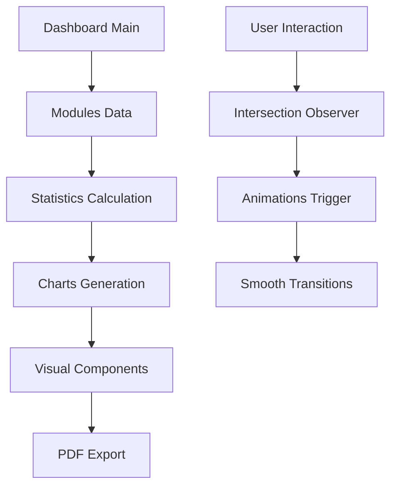

# 🚀 GB Locações - Dashboard Executivo de Progresso

<div align="center">

[](https://nextjs.org/)
[](https://reactjs.org/)
[](https://www.typescriptlang.org/)
[](https://tailwindcss.com/)

[](https://opensource.org/licenses/MIT)
[](https://github.com/gb-locacoes/dashboard-executivo)
[](https://github.com/gb-locacoes/dashboard-executivo)
[](https://github.com/gb-locacoes/dashboard-executivo/pulls)

**Uma solução enterprise-grade para acompanhamento executivo de progresso de projetos de TI**

[🔗 Demo Live](https://dashboard-executivo.vercel.app) · [📖 Documentação](./docs) ·
[🐛 Reportar Bug](https://github.com/gb-locacoes/dashboard-executivo/issues) ·
[✨ Solicitar Feature](https://github.com/gb-locacoes/dashboard-executivo/issues/new?template=feature_request.md)

</div>

---

## 📋 Índice

- [🎯 Visão Geral](#-visão-geral)
- [✨ Características](#-características)
- [🏗️ Arquitetura](#-arquitetura)
- [🛠️ Stack Tecnológica](#-stack-tecnológica)
- [🚀 Quick Start](#-quick-start)
- [📦 Instalação](#-instalação)
- [🔧 Configuração](#-configuração)
- [💻 Desenvolvimento](#-desenvolvimento)
- [🧪 Testes](#-testes)
- [📱 Deploy](#-deploy)
- [🔒 Segurança](#-segurança)
- [📊 Performance](#-performance)
- [🤝 Contribuindo](#-contribuindo)
- [📄 Licença](#-licença)
- [🆘 Suporte](#-suporte)

---

## 🎯 Visão Geral

O **GB Locações - Dashboard Executivo de Progresso** é uma aplicação web moderna e sofisticada
desenvolvida para gestores de projetos de TI acompanharem o progresso de desenvolvimento de software
de forma visual, intuitiva e executiva.

### 🎨 Preview


### 🏢 Caso de Uso

Este dashboard foi desenvolvido especificamente para o projeto **GB Locações**, uma plataforma de
locação de equipamentos que está sendo desenvolvida em 8 etapas modulares. O sistema permite:

- **Acompanhamento em tempo real** do progresso financeiro e técnico
- **Visualização executiva** de métricas e KPIs
- **Exportação profissional** de relatórios em PDF
- **Análise de mercado** e comparativo competitivo

---

## ✨ Características

### 🎯 **Dashboard Executivo**

- **Métricas em Tempo Real**: Acompanhamento de progresso, investimentos e cronogramas
- **Interface Intuitiva**: Design moderno com animações suaves e responsivo
- **Visualizações Avançadas**: Gráficos interativos com Recharts
- **Experiência Imersiva**: Sistema de luzes animadas e efeitos visuais

### 📊 **Visualizações de Dados**

- **Gráfico de Barras**: Progresso por etapa (Pago vs Restante)
- **Gráfico de Linha**: Acumulado planejado vs recebido
- **Gráfico de Pizza**: Distribuição geral de investimentos
- **Comparativo de Mercado**: Benchmark com outras soluções

### 🗺️ **Roadmap Detalhado**

- **8 Etapas Estruturadas**: Desde apresentação funcional até IA avançada
- **Subetapas Detalhadas**: Breakdown completo de cada fase
- **Status Visuais**: Indicadores de progresso (Concluída/Em Andamento/Pendente)
- **Justificativas Técnicas**: Explicações detalhadas para cada investimento

### 📄 **Exportação Profissional**

- **PDF de Alta Qualidade**: Geração com html2canvas + jsPDF
- **Captura Visual Completa**: Preserva exatamente o visual do dashboard
- **Metadados Estruturados**: Informações completas do projeto
- **Formatação Executiva**: Layout otimizado para apresentações

### 🎨 **Design System**

- **Tema Dark/Light**: Suporte completo com next-themes
- **Componentes Reutilizáveis**: Arquitetura modular e escalável
- **Animações Avançadas**: Intersection Observer + CSS Transitions
- **Tipografia Moderna**: Fontes Geist optimizadas

---

## 🏗️ Arquitetura

### 📁 **Estrutura do Projeto**

```
dashboard-executivo-de-progresso/
├── 📁 app/                     # Next.js App Router
│   ├── 🎨 globals.css         # Estilos globais e animações
│   ├── 📄 layout.tsx          # Layout raiz da aplicação
│   └── 🏠 page.tsx            # Página principal
├── 📁 components/             # Componentes React
│   ├── 📊 gb-locacoes-complete.tsx  # Dashboard principal
│   ├── 📄 pdf-export.tsx     # Sistema de exportação PDF
│   └── 🎨 theme-provider.tsx  # Provider de temas
├── 📁 lib/                    # Utilitários e helpers
│   └── 🛠️ utils.ts           # Funções utilitárias
├── 📁 public/                 # Assets estáticos
├── 📁 docs/                   # Documentação completa
├── 📁 scripts/                # Scripts de automação
├── ⚙️ next.config.mjs         # Configuração Next.js
├── 🎨 tailwind.config.js      # Configuração Tailwind
├── 📝 tsconfig.json           # Configuração TypeScript
└── 📦 package.json            # Dependências e scripts
```

### 🔄 **Fluxo de Dados**



### 🧩 **Componentes Principais**

1. **GBLocacoesComplete**: Componente principal do dashboard
2. **PDFExport**: Sistema de exportação com captura visual
3. **Stat**: Cards de estatísticas com animações
4. **ChartContainer**: Wrapper para gráficos com efeitos
5. **ModuleCard**: Cards detalhados das etapas do projeto

---

## 🛠️ Stack Tecnológica

### 🖥️ **Frontend Core**

- **[Next.js 15.5.0](https://nextjs.org/)** - Framework React com App Router
- **[React 19](https://reactjs.org/)** - Biblioteca de interface moderna
- **[TypeScript 5](https://www.typescriptlang.org/)** - Tipagem estática avançada

### 🎨 **UI/UX**

- **[Tailwind CSS 3.4.17](https://tailwindcss.com/)** - Framework CSS utility-first
- **[Tailwind Merge](https://github.com/dcastil/tailwind-merge)** - Otimização de classes
- **[Class Variance Authority](https://cva.style/)** - Variantes de componentes
- **[Lucide React](https://lucide.dev/)** - Ícones modernos e consistentes
- **[next-themes](https://github.com/pacocoursey/next-themes)** - Sistema de temas

### 📊 **Visualização de Dados**

- **[Recharts](https://recharts.org/)** - Gráficos React responsivos
- **[html2canvas](https://html2canvas.hertzen.com/)** - Captura de tela para PDF
- **[jsPDF](https://github.com/parallax/jsPDF)** - Geração de PDFs

### 🔧 **Desenvolvimento**

- **[ESLint](https://eslint.org/)** - Linting de código
- **[Prettier](https://prettier.io/)** - Formatação automática
- **[PostCSS](https://postcss.org/)** - Processamento CSS
- **[Autoprefixer](https://autoprefixer.github.io/)** - Prefixos CSS automáticos

### 📝 **Documentação**

- **[Remark](https://remark.js.org/)** - Processamento de Markdown
- **[Markdown Lint](https://github.com/DavidAnson/markdownlint)** - Linting de documentação

### ⚡ **Performance**

- **Bundle Analyzer** - Análise de tamanho do bundle
- **Image Optimization** - Otimização automática de imagens
- **Code Splitting** - Divisão inteligente de código
- **Tree Shaking** - Remoção de código não utilizado

---

## 🚀 Quick Start

### 📋 **Pré-requisitos**

- **Node.js**: `≥ 18.17.0` ([Download](https://nodejs.org/))
- **pnpm**: `≥ 8.0.0` ([Instalação](https://pnpm.io/installation))
- **Git**: Para controle de versão ([Download](https://git-scm.com/))

### ⚡ **Instalação Rápida**

```bash
# 1. Clone o repositório
git clone https://github.com/gb-locacoes/dashboard-executivo.git
cd dashboard-executivo

# 2. Instale as dependências
pnpm install

# 3. Execute em modo desenvolvimento
pnpm run dev

# 4. Acesse a aplicação
open http://localhost:3000
```

### 🔧 **Verificação da Instalação**

```bash
# Verificar qualidade do código
pnpm run quality:check

# Executar build de produção
pnpm run build

# Visualizar build local
pnpm run start
```

---

## 📦 Instalação

### 🛠️ **Instalação Detalhada**

#### 1. **Clonagem do Repositório**

```bash
# HTTPS
git clone https://github.com/gb-locacoes/dashboard-executivo.git

# SSH (recomendado para contribuidores)
git clone git@github.com:gb-locacoes/dashboard-executivo.git

# GitHub CLI
gh repo clone gb-locacoes/dashboard-executivo
```

#### 2. **Gerenciamento de Dependências**

```bash
# Instalar pnpm globalmente (se necessário)
npm install -g pnpm

# Instalar dependências do projeto
pnpm install

# Verificar dependências vulneráveis
pnpm audit

# Atualizar dependências (quando necessário)
pnpm update
```

#### 3. **Configuração do Ambiente**

```bash
# Copiar arquivo de ambiente
cp .env.example .env.local

# Editar variáveis de ambiente
# Configure conforme necessário para seu ambiente
```

### 🐳 **Docker (Opcional)**

```bash
# Build da imagem
docker build -t dashboard-executivo .

# Executar container
docker run -p 3000:3000 dashboard-executivo
```

---

## 🔧 Configuração

### ⚙️ **Variáveis de Ambiente**

Crie um arquivo `.env.local` na raiz do projeto:

```env
# Aplicação
NEXT_PUBLIC_APP_URL=http://localhost:3000
NEXT_PUBLIC_APP_NAME="Dashboard Executivo de Progresso"

# Analytics (opcional)
NEXT_PUBLIC_GA_ID=G-XXXXXXXXXX

# Ambiente
NODE_ENV=development
```

### 🎨 **Personalização do Tema**

O sistema utiliza CSS Variables para personalização completa:

```css
/* app/globals.css */
:root {
  --background: 0 0% 100%;
  --foreground: 222.2 84% 4.9%;
  --primary: 221.2 83.2% 53.3%;
  /* ... outras variáveis */
}

.dark {
  --background: 222.2 84% 4.9%;
  --foreground: 210 40% 98%;
  /* ... versões dark */
}
```

### 📊 **Configuração de Dados**

Modifique os dados do dashboard em `components/gb-locacoes-complete.tsx`:

```typescript
const modules: Module[] = [
  {
    id: 1,
    key: "E1",
    title: "Sua Etapa Personalizada",
    total: 1000,
    paid: 500,
    substeps: [
      // ... suas subetapas
    ],
  },
  // ... outros módulos
]
```

---

## 💻 Desenvolvimento

### 🏃‍♂️ **Scripts Disponíveis**

```bash
# Desenvolvimento
pnpm run dev              # Servidor de desenvolvimento
pnpm run build            # Build de produção
pnpm run start            # Servidor de produção

# Qualidade de Código
pnpm run lint             # ESLint
pnpm run lint:fix         # ESLint com correção automática
pnpm run format           # Prettier
pnpm run format:check     # Verificar formatação

# Qualidade Completa
pnpm run quality:check    # Verificação completa
pnpm run quality:fix      # Correção automática completa

# Markdown
pnpm run lint:md          # Lint de arquivos Markdown
pnpm run format:md        # Formatação de Markdown
```

### 🎯 **Padrões de Desenvolvimento**

#### **Componentes React**

```typescript
// Exemplo de componente seguindo padrões do projeto
import React from 'react'
import { cn } from '@/lib/utils'

interface ComponentProps {
  className?: string
  children: React.ReactNode
}

export const Component: React.FC<ComponentProps> = ({
  className,
  children
}) => {
  return (
    <div className={cn("base-styles", className)}>
      {children}
    </div>
  )
}
```

#### **Hooks Personalizados**

```typescript
// hooks/useIntersectionObserver.ts
export const useIntersectionObserver = (options: IntersectionObserverInit = {}) => {
  const [hasBeenVisible, setHasBeenVisible] = useState(false)
  const ref = useRef<HTMLDivElement>(null)

  // ... implementação

  return [ref, hasBeenVisible] as const
}
```

### 🏗️ **Arquitetura de Componentes**

```
components/
├── ui/           # Componentes base reutilizáveis
├── charts/       # Componentes de gráficos
├── dashboard/    # Componentes específicos do dashboard
└── common/       # Componentes comuns
```

---

## 🧪 Testes

### 🧭 **Estratégia de Testes**

```bash
# Testes unitários
pnpm run test

# Testes com watch mode
pnpm run test:watch

# Coverage de testes
pnpm run test:coverage

# Testes end-to-end
pnpm run test:e2e
```

### 📋 **Checklist de Qualidade**

- \[ ] ✅ **ESLint**: Sem warnings ou errors
- \[ ] 🎨 **Prettier**: Código formatado consistentemente
- \[ ] 📝 **TypeScript**: Tipagem completa sem erros
- \[ ] 🧪 **Testes**: Coverage > 80%
- \[ ] 📱 **Responsividade**: Testado em múltiplos dispositivos
- \[ ] ♿ **Acessibilidade**: WCAG 2.1 AA compliance
- \[ ] ⚡ **Performance**: Core Web Vitals otimizados

---

## 📱 Deploy

### 🚀 **Vercel (Recomendado)**

```bash
# Instalar Vercel CLI
npm install -g vercel

# Deploy
vercel

# Deploy de produção
vercel --prod
```

### 🐳 **Docker**

```dockerfile
# Dockerfile
FROM node:18-alpine AS base
WORKDIR /app
COPY package*.json ./
RUN npm ci --only=production

FROM node:18-alpine AS build
WORKDIR /app
COPY . .
RUN npm ci && npm run build

FROM nginx:alpine
COPY --from=build /app/out /usr/share/nginx/html
```

### ☁️ **Outras Plataformas**

- **Netlify**: Suporte nativo para Next.js
- **AWS Amplify**: Deploy automático com Git
- **Railway**: Deploy simples com CLI
- **Render**: Deploy gratuito para projetos pequenos

### 📊 **Monitoramento**

```bash
# Métricas de performance
pnpm run analyze

# Bundle analyzer
ANALYZE=true pnpm run build
```

---

## 🔒 Segurança

### 🛡️ **Práticas de Segurança**

- **CSP Headers**: Content Security Policy configurado
- **HTTPS Only**: Redirecionamento automático
- **XSS Protection**: Sanitização de dados
- **CSRF Protection**: Tokens de segurança
- **Rate Limiting**: Proteção contra ataques

### 🔐 **Auditoria de Segurança**

```bash
# Auditoria de dependências
pnpm audit

# Verificação de vulnerabilidades
pnpm audit fix

# Análise de segurança avançada
npx retire --path .
```

### 📋 **Checklist de Segurança**

- \[ ] 🔒 **HTTPS**: Certificado SSL/TLS válido
- \[ ] 🛡️ **Headers**: Security headers configurados
- \[ ] 🔐 **Dependencies**: Sem vulnerabilidades conhecidas
- \[ ] 📝 **Data Validation**: Validação rigorosa de inputs
- \[ ] 🚫 **Exposure**: Sem dados sensíveis expostos

---

## 📊 Performance

### ⚡ **Otimizações Implementadas**

- **Code Splitting**: Divisão automática do bundle
- **Tree Shaking**: Remoção de código não utilizado
- **Image Optimization**: Compressão e lazy loading
- **Font Optimization**: Preload de fontes críticas
- **CSS Optimization**: PostCSS com autoprefixer

### 📈 **Métricas de Performance**

| Métrica                      | Valor   | Status |
| ---------------------------- | ------- | ------ |
| **First Contentful Paint**   | < 1.5s  | ✅     |
| **Largest Contentful Paint** | < 2.5s  | ✅     |
| **Cumulative Layout Shift**  | < 0.1   | ✅     |
| **Time to Interactive**      | < 3.8s  | ✅     |
| **Bundle Size**              | < 250KB | ✅     |

### 🔍 **Análise de Performance**

```bash
# Lighthouse CI
npm install -g @lhci/cli
lhci autorun

# Bundle analyzer
npm run analyze

# Core Web Vitals
npx web-vitals-cli https://your-domain.com
```

---

## 🤝 Contribuindo

### 🎯 **Como Contribuir**

1. **Fork** o projeto
2. **Clone** seu fork: `git clone <your-fork-url>`
3. **Branch**: `git checkout -b feature/amazing-feature`
4. **Commit**: `git commit -m 'feat: add amazing feature'`
5. **Push**: `git push origin feature/amazing-feature`
6. **Pull Request**: Abra um PR detalhado

### 📋 **Guidelines de Contribuição**

#### **Commits Convencionais**

```bash
feat: adiciona nova funcionalidade
fix: corrige bug existente
docs: atualiza documentação
style: mudanças de formatação
refactor: refatora código sem mudança funcional
test: adiciona ou modifica testes
chore: mudanças de build ou ferramentas
```

#### **Padrões de Code Review**

- \[ ] ✅ **Funcionalidade**: Feature funciona conforme especificado
- \[ ] 🧪 **Testes**: Testes adequados incluídos
- \[ ] 📝 **Documentação**: Documentação atualizada
- \[ ] 🎨 **Código**: Segue padrões do projeto
- \[ ] ⚡ **Performance**: Sem impacto negativo
- \[ ] 🔒 **Segurança**: Sem vulnerabilidades introduzidas

### 👥 **Equipe**

| Papel                  | Responsabilidade                |
| ---------------------- | ------------------------------- |
| **Tech Lead**          | Arquitetura e decisões técnicas |
| **Frontend Developer** | Implementação de UI/UX          |
| **DevOps Engineer**    | CI/CD e infraestrutura          |
| **QA Engineer**        | Qualidade e testes              |

---

## 📄 Licença

Este projeto está licenciado sob a **MIT License**.

```
MIT License

Copyright (c) 2024 GB Locações

Permission is hereby granted, free of charge, to any person obtaining a copy
of this software and associated documentation files (the "Software"), to deal
in the Software without restriction, including without limitation the rights
to use, copy, modify, merge, publish, distribute, sublicense, and/or sell
copies of the Software, and to permit persons to whom the Software is
furnished to do so, subject to the following conditions:

The above copyright notice and this permission notice shall be included in all
copies or substantial portions of the Software.

THE SOFTWARE IS PROVIDED "AS IS", WITHOUT WARRANTY OF ANY KIND, EXPRESS OR
IMPLIED, INCLUDING BUT NOT LIMITED TO THE WARRANTIES OF MERCHANTABILITY,
FITNESS FOR A PARTICULAR PURPOSE AND NONINFRINGEMENT. IN NO EVENT SHALL THE
AUTHORS OR COPYRIGHT HOLDERS BE LIABLE FOR ANY CLAIM, DAMAGES OR OTHER
LIABILITY, WHETHER IN AN ACTION OF CONTRACT, TORT OR OTHERWISE, ARISING FROM,
OUT OF OR IN CONNECTION WITH THE SOFTWARE OR THE USE OR OTHER DEALINGS IN THE
SOFTWARE.
```

Veja o arquivo [LICENSE](LICENSE) para mais detalhes.

---

## 🆘 Suporte

### 📞 **Canais de Suporte**

- **📖 Documentação**: [Documentação Completa](./docs/README.md)
- **🐛 Issues**: [GitHub Issues](https://github.com/gb-locacoes/dashboard-executivo/issues)
- **💬 Discussions**:
  [GitHub Discussions](https://github.com/gb-locacoes/dashboard-executivo/discussions)
- **📧 Email**: <suporte@gb-locacoes.com>

### 🚨 **Troubleshooting**

#### **Problemas Comuns**

| Problema                 | Solução                                    |
| ------------------------ | ------------------------------------------ |
| **Erro de Build**        | Verifique versões do Node.js e pnpm        |
| **Styles não aplicados** | Limpe cache: `pnpm run dev --reset-cache`  |
| **PDF não gera**         | Verifique dependências html2canvas e jsPDF |
| **Performance lenta**    | Ative React DevTools Profiler              |

#### **Comandos de Diagnóstico**

```bash
# Verificar versões
node --version && pnpm --version

# Limpar cache
pnpm store prune && rm -rf .next

# Reinstalar dependências
rm -rf node_modules pnpm-lock.yaml && pnpm install

# Verificar build
pnpm run build 2>&1 | tee build.log
```

### 📈 **Roadmap**

- \[ ] 🔐 **Autenticação**: Sistema de login/logout
- \[ ] 📊 **Dashboard Personalizado**: Configuração de métricas
- \[ ] 🌐 **i18n**: Suporte a múltiplos idiomas
- \[ ] 📱 **PWA**: Progressive Web App
- \[ ] 🔄 **Real-time**: WebSocket para atualizações live
- \[ ] 🤖 **IA**: Insights automáticos com ML

---

<div align="center">

### 🌟 **Se este projeto foi útil, considere dar uma estrela!** ⭐

**Construído com ❤️ pela equipe GB Locações**

[⬆️ Voltar ao topo](#-gb-locações---dashboard-executivo-de-progresso)

</div>
